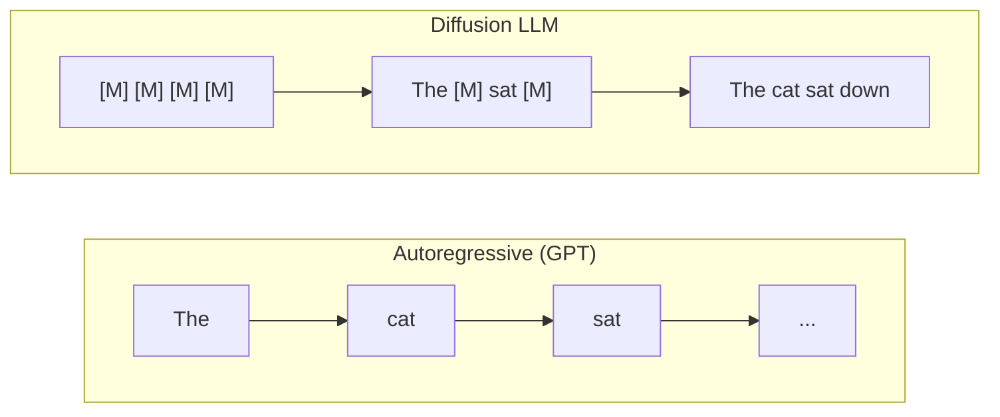
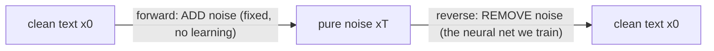
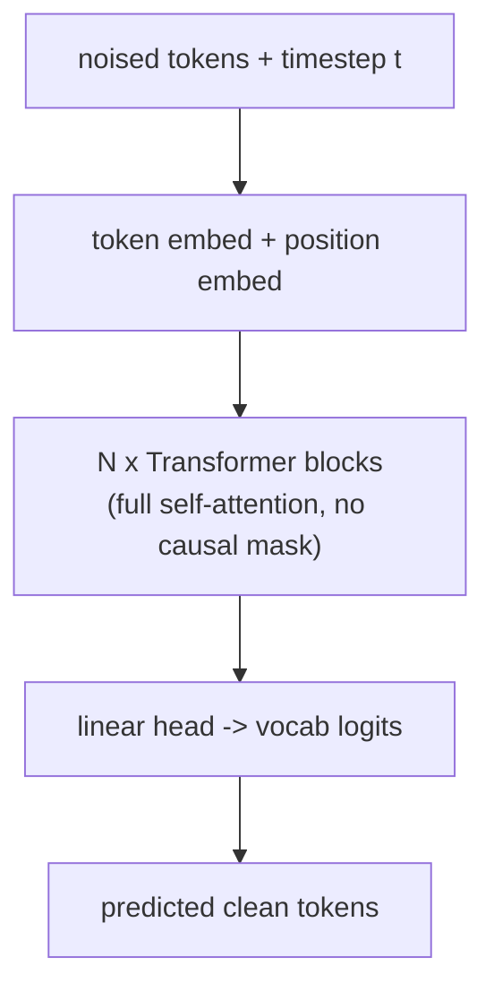

# Diffusion LLMs — Overview

Goal of this doc set: understand the **three main families of discrete text diffusion** before we
build one from scratch. Each method gets its own file with a simple mermaid diagram.

- [01 — Masked / Absorbing diffusion (MDLM, LLaDA)](01-masked-diffusion.md) ← **the one we'll build**
- [02 — D3PM (general discrete diffusion)](02-d3pm.md)
- [03 — SEDD (score entropy)](03-sedd.md)

---

## The one idea behind all of them

A normal (autoregressive) LLM like GPT writes **left to right, one token at a time**. It can never
revise an earlier word.

A **diffusion LLM** generates a whole sequence **in parallel, by iterative refinement**. It starts
from pure noise (e.g. an all-`[MASK]` sentence) and, over a handful of steps, repeatedly cleans it
up until it's real text.

Two processes define any diffusion model:

- **Forward process** — a *fixed* recipe that corrupts clean text into noise. No learning here.
- **Reverse process** — a *learned* neural net (a Transformer) that undoes one step of corruption.
  Training = teach it to reverse. Generation = run the reverse process from noise.

The three families differ **only in what "noise" means** and **what loss trains the reverse net**.

| Method | What "noise" is | Loss | Difficulty | Notes |
|---|---|---|---|---|
| **Masked / absorbing** (MDLM, LLaDA) | replace tokens with `[MASK]` | (weighted) cross-entropy on masked positions | ★ easiest | what LLaDA-8B uses; our pick |
| **D3PM** | jump to a random token via a transition matrix | KL between categorical posteriors (ELBO) | ★★ | the general framework; masking is a special case |
| **SEDD** | same corruption, but model learns *ratios* | denoising **score entropy** | ★★★ | strongest perplexity; most math |

---

## The Transformer underneath (shared by all three)

Crucial difference from GPT: diffusion LLMs use a Transformer with **bidirectional (full) attention**
— every token sees every other token, because we're refining the *whole* sequence at once, not
predicting the next token. There is **no causal mask**.

So architecturally it's "BERT that you can run at any noise level and sample from," rather than "GPT."

---

## How we'll use these docs

1. Read all three to see the landscape (and why people pick each).
2. Build **masked diffusion** from scratch (file 01) — cleanest path, transfers directly to LLaDA.
3. Revisit D3PM/SEDD later as theory once our model talks.

## Sources

- MDLM — [Sahoo et al., NeurIPS 2024](https://arxiv.org/pdf/2406.07524) · [project page](https://s-sahoo.com/mdlm/) · [code](https://github.com/kuleshov-group/mdlm)
- Simplified/Generalized masked diffusion — [Shi et al. 2024](https://arxiv.org/pdf/2406.04329)
- D3PM — [Austin et al., NeurIPS 2021](https://arxiv.org/abs/2107.03006)
- SEDD — [Lou, Meng, Ermon, ICML 2024 (best paper)](https://arxiv.org/abs/2310.16834) · [code](https://github.com/louaaron/Score-Entropy-Discrete-Diffusion)
- LLaDA — [Nie et al. 2025](https://arxiv.org/abs/2502.09992) · [project page](https://ml-gsai.github.io/LLaDA-demo/) · [code](https://github.com/ML-GSAI/LLaDA)
