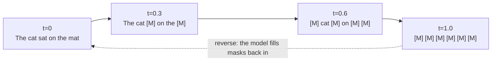
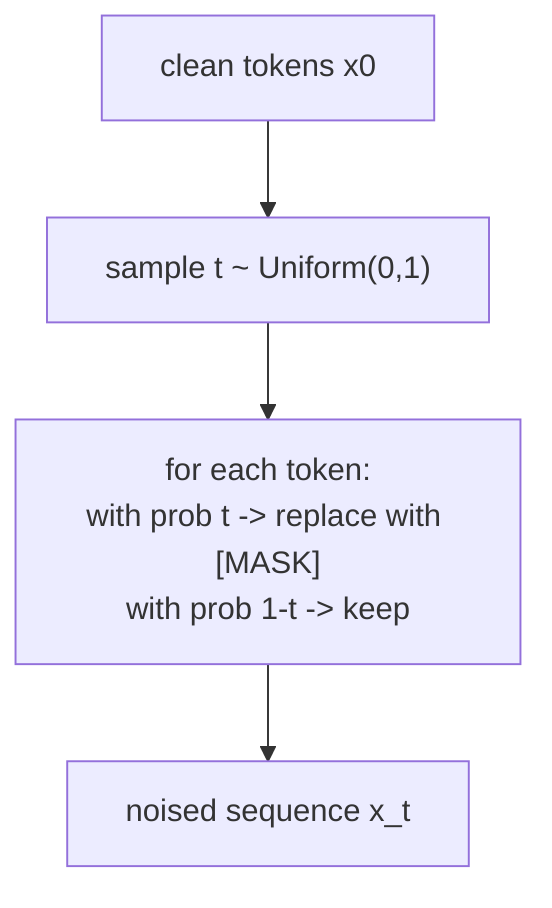
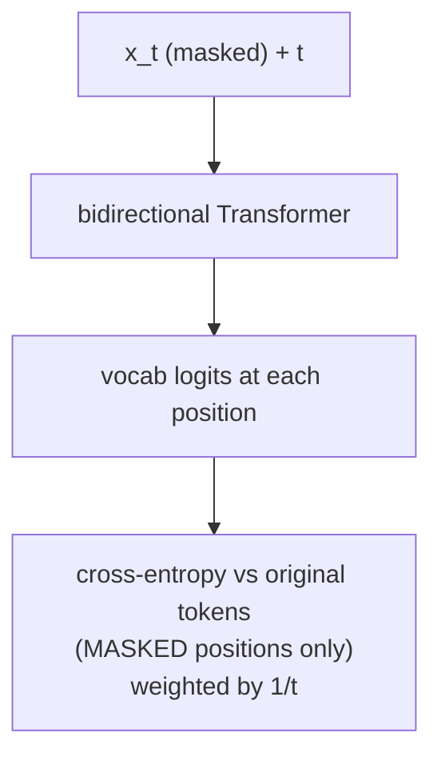
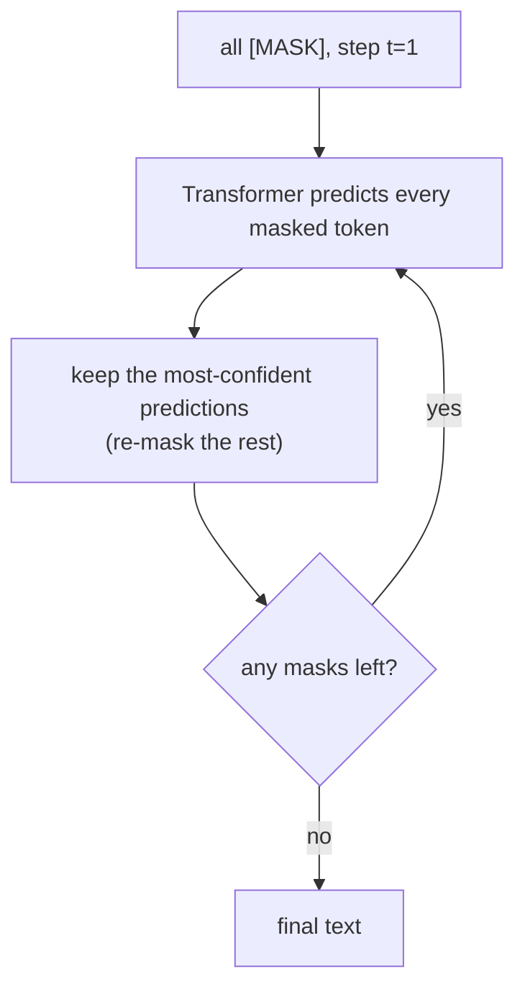

# 01 — Masked / Absorbing-State Diffusion (MDLM, LLaDA)

**This is the method we'll build.** It's the simplest to understand and it's exactly what the
8B-parameter **LLaDA** model uses. If you've seen BERT's masked language modeling, you already know
80% of this.

---

## The core idea

"Noise" = **hiding tokens behind a `[MASK]` symbol.** More noise → more tokens masked. The extreme
(`t = 1`) is an entirely masked sentence. The clean text (`t = 0`) has nothing masked.

`[MASK]` is called an **absorbing state**: once a token becomes `[MASK]` in the forward process, it
stays `[MASK]`. Corruption only ever adds masks, never changes one real word into another.



---

## Forward process (fixed — no learning)

Pick a noise level `t` in `[0, 1]`. Each token is **independently** masked with probability `t`.

That's the entire forward process. No transition matrix, no schedule subtlety needed to start.



---

## Training the reverse net

Feed the masked sequence `x_t` and the timestep `t` into a **bidirectional Transformer**. It outputs,
for every masked position, a probability distribution over the vocabulary — its guess at the original
token. We compute loss **only on the masked positions**.



In plain terms the loss is: *"of the tokens I hid, how well did you recover them?"* — classic
masked-LM cross-entropy, just at a randomly-chosen mask ratio each step, with a `1/t` weight that
makes it a proper diffusion ELBO (this weighting is MDLM's key simplification).

```python
# pseudo-code — the whole training step
t = uniform(0, 1)                      # noise level
mask = rand_like(x0) < t               # which tokens to hide
x_t = where(mask, MASK_ID, x0)         # apply mask
logits = transformer(x_t, t)           # predict originals
loss = cross_entropy(logits[mask], x0[mask]) / t   # only on hidden tokens
```

That's it. No KL divergences, no transition matrices — just weighted cross-entropy.

---

## Generation (sampling)

Start from an all-`[MASK]` sequence and unmask over a few steps. Each step: predict all masked
tokens, **commit** the most confident ones, leave the rest masked, repeat.



You control a **speed/quality knob**: few steps = fast but rougher; many steps = slower, more
coherent. (Autoregressive models can't trade off like this.)

---

## Why we picked it

- **Simplest loss**: cross-entropy you already understand.
- **Forgiving to debug** at tiny scale — easy to sanity-check (mask one word, see if it recovers).
- **Transfers directly to LLaDA**, the real model in this family, so learning compounds.
- Bidirectional attention + parallel refinement makes the "diffusion vs GPT" difference concrete.

## What's hand-wavy here (we'll tighten later)

- The exact `1/t` loss weighting and why it's a valid likelihood bound (the MDLM derivation).
- Smarter remasking/confidence schedules during sampling.
- Classifier-free-style conditioning for the chat finetune (mask only the response, like LLaDA's SFT).

## Sources

- [MDLM — Sahoo et al., NeurIPS 2024](https://arxiv.org/pdf/2406.07524) · [project page](https://s-sahoo.com/mdlm/)
- [Simplified & Generalized Masked Diffusion — Shi et al. 2024](https://arxiv.org/pdf/2406.04329)
- [LLaDA — Nie et al. 2025](https://arxiv.org/abs/2502.09992)
