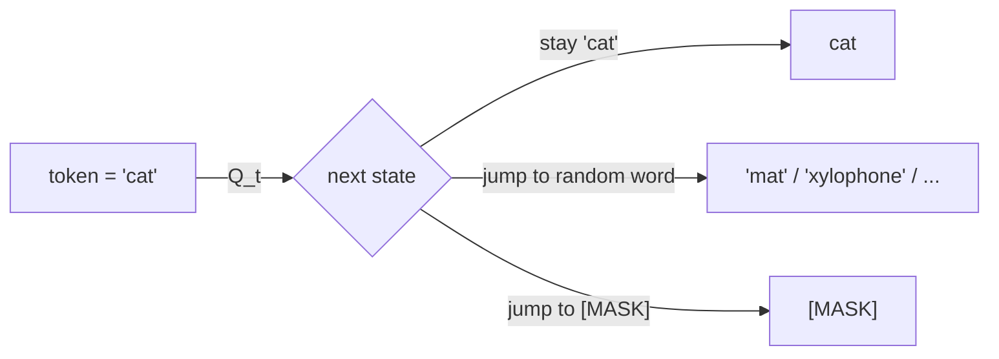
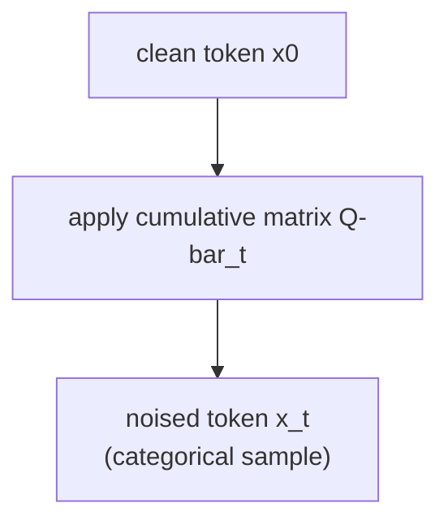
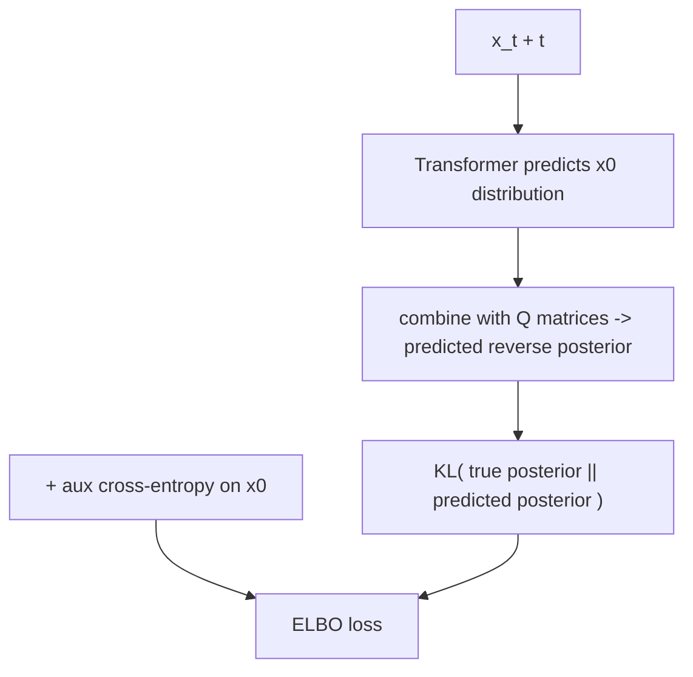
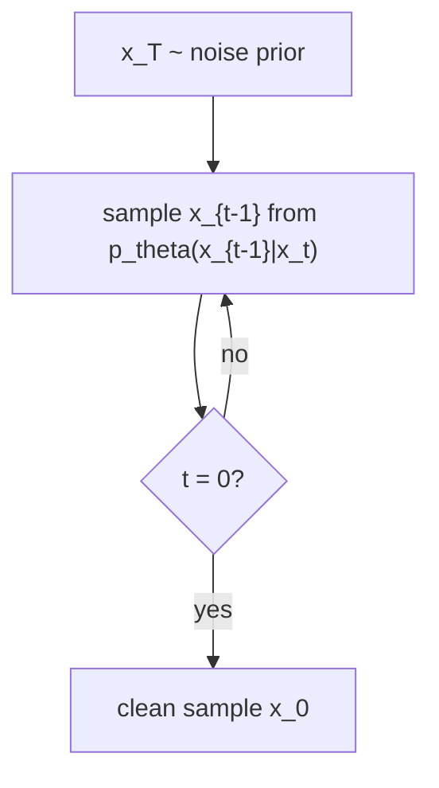

# 02 — D3PM (Discrete Denoising Diffusion Probabilistic Models)

D3PM (Austin et al., 2021) is the **general framework** for discrete diffusion. Masked diffusion
(file 01) is actually just *one special case* of D3PM. Understanding D3PM shows you the full design
space.

---

## The core idea

Instead of only masking, corruption is defined by a **transition matrix** `Q_t`: a table of
probabilities saying "if a token is currently word `i`, what's the chance it becomes word `j` at the
next noise step?"

By choosing different `Q_t` you get different diffusion behaviors:

| Choice of Q_t | Behavior | Equivalent to |
|---|---|---|
| **Absorbing** | tokens decay into `[MASK]` | **= masked diffusion (file 01)** |
| **Uniform** | tokens randomly flip to any other token | "BERT-noise" style |
| **Gaussian-like** (ordinal) | tokens drift to *nearby* tokens | for ordered data (e.g. pixels) |

So masked diffusion = D3PM with an absorbing-state matrix. D3PM is the parent.

---

## Forward process

Multiply through the chain of transition matrices. Conveniently, you can jump straight to any noise
level `t` in one shot using the cumulative product `Q̄_t = Q_1 Q_2 ... Q_t`.

---

## Training the reverse net

Here's where D3PM is heavier than masked diffusion. The model predicts the clean token, but the loss
isn't plain cross-entropy — it's a **KL divergence** between two categorical distributions:

- the *true* reverse posterior `q(x_{t-1} | x_t, x_0)` (computable from the matrices), and
- the model's *predicted* reverse `p_θ(x_{t-1} | x_t)`.

Summed over steps, this forms a variational bound (ELBO), usually plus an auxiliary cross-entropy
term on `x_0`.

This matrix bookkeeping is exactly what masked diffusion's `1/t`-weighted cross-entropy *quietly
collapses into* — which is why MDLM is so much simpler to implement.

---

## Generation

Same shape as all diffusion: start from the noise distribution (for absorbing, all `[MASK]`), then
repeatedly sample `x_{t-1}` from the model's predicted reverse posterior until `t = 0`.

---

## Why we're NOT starting here

- The transition-matrix + KL-posterior machinery is more code and more places to get the math subtly
  wrong, with little payoff at tiny scale.
- The most useful instance (absorbing) is precisely masked diffusion, which we get more cheaply in
  file 01.

## Why it's worth knowing

- It's the **map of the whole territory**: you can see masked, uniform, and ordinal diffusion as
  points in one framework.
- Great mental model for *why* the masked-diffusion loss has the form it does.

## Sources

- [D3PM — Austin, Johnson, Ho, Tarlow, van den Berg, NeurIPS 2021](https://arxiv.org/abs/2107.03006)
