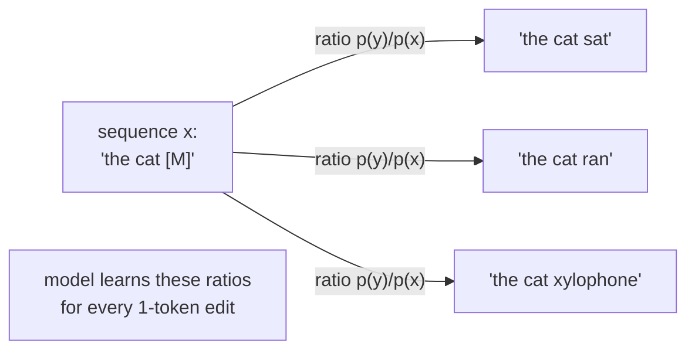
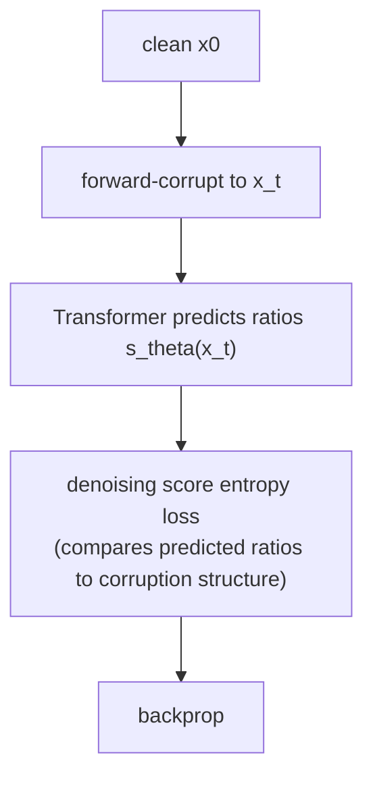
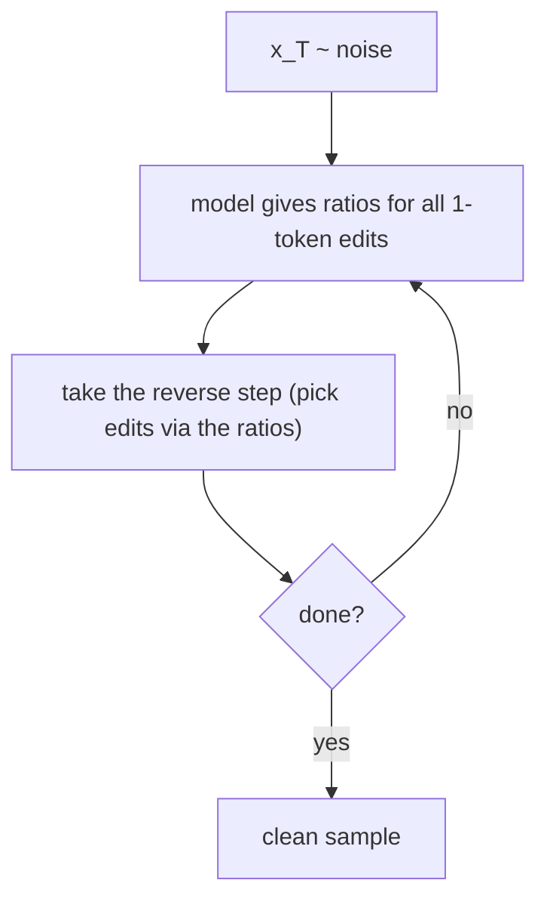

# 03 — SEDD (Score Entropy Discrete Diffusion)

SEDD (Lou, Meng, Ermon — ICML 2024 **best paper**) is the most powerful and most mathematically
demanding of the three. It beat prior diffusion LMs by 25–75% perplexity and even outperformed GPT-2
on some benchmarks. The price: the hardest concept to hold in your head.

---

## The core idea: learn *ratios*, not tokens

Continuous image diffusion works by learning a **score** — the gradient `∇ log p(x)` that points
"toward more probable data." That gradient doesn't exist for discrete tokens (you can't take a
derivative over a vocabulary).

SEDD's trick: replace the gradient with a **ratio between neighboring states**.

> For two sequences `y` and `x` that differ in one token, learn the ratio `p(y) / p(x)`
> — "how much more likely is `y` than `x`?"

This collection of ratios is the **concrete score**. Knowing all these ratios is enough to run the
reverse diffusion.

---

## The loss: score entropy

The reverse process needs those ratios, so we need a loss that teaches them from data. Plain
regression on ratios is unstable (ratios are positive, unbounded, can blow up). **Score entropy** is
a specially designed loss that:

- is well-behaved for positive ratio-valued targets,
- reduces to a clean **denoising** form you can train by sampling noised pairs (no need to know the
  true ratios — they cancel, like denoising score matching in continuous diffusion),
- is a proper bound on likelihood.

Think of it as: D3PM trains the model to predict *clean tokens*; SEDD trains it to predict
*how relative-likelihood changes when you edit one token*. The latter turns out to be a richer,
better-calibrated training signal.

---

## Generation

Use the learned ratios to drive the reverse process — at each step the ratios tell you which
single-token edits move you toward higher-probability text. SEDD also introduced improved samplers
(e.g. analytic / Tweedie-style denoising) that give better quality at fewer steps.

---

## A useful connection

Later work showed that **absorbing-state SEDD and masked diffusion (MDLM) are closely related** — an
absorbing diffusion model "secretly" estimates these ratios. So once you understand file 01, SEDD is
the principled, higher-performance generalization rather than a totally separate thing.

---

## Why we're NOT starting here

- The "learn ratios via score entropy" objective is the steepest learning curve and easiest to
  implement subtly wrong — bad first project.
- Its big wins show up at scale and with careful sampling; at tiny scale you'd pay the complexity
  cost without seeing the payoff.

## Why it's worth knowing

- It's the **state of the art** in the discrete-diffusion-theory lineage.
- Shows the deep link between diffusion, score matching, and masking — the "why it all works" layer.

## Sources

- [SEDD — Lou, Meng, Ermon, ICML 2024](https://arxiv.org/abs/2310.16834) · [code](https://github.com/louaaron/Score-Entropy-Discrete-Diffusion)
- ["Your Absorbing Discrete Diffusion Secretly Models..." — connection to masked diffusion](https://openreview.net/pdf?id=0dcMmg0v1l)
